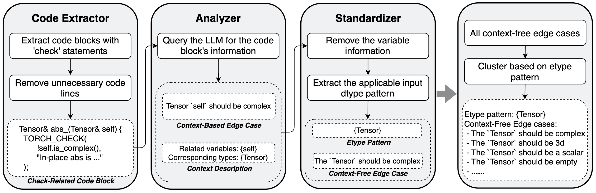

# Description
DFUZZ is a novel fuzzer that uses LLM to infer edge cases and generate initial test programs, which offer effective and efficient DL library API fuzzing. Evaluations show that DFUZZ consistently outperforms existing DL library fuzzers for PyTorch and TensorFlow.

<kbd>

</kbd>
 The framework of DFUZZ.

# Run
DFUZZ is divided into three parts: Context-Free Edge Case Extraction, Get API Description, and Edge Case-Based Mutation.

## Context-Free Edge Case Extraction
Corresponding to the "edge_case_extraction" folder, used to extract edge cases from PyTorch source code.

## Get API Description
Corresponding to the "get_api_reference" folder, used to generate the description for the target APIs.

## Edge Case-Based Mutation
Corresponding to the "gen_program" folder, used to generate initial programs and perform edge case-based mutation.
